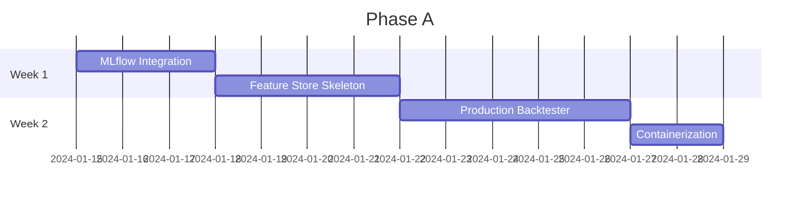

# ML Model Factory - Improvement Roadmap

[]()
[]()
[]()
[]()

> **Deep analysis of the ML Model Factory codebase identifying improvements needed for reliable single model and ensemble training.**

---

## Table of Contents

- [Executive Summary](#executive-summary)
- [Current Status](#current-status)
- [Priority 1: Critical Blockers](#priority-1-critical-blockers)
- [Priority 2: High Impact](#priority-2-high-impact)
- [Priority 3: Medium Impact](#priority-3-medium-impact)
- [Priority 4: Nice to Have](#priority-4-nice-to-have)
- [What's Already Excellent](#whats-already-excellent)
- [Implementation Timeline](#implementation-timeline)

---

## Executive Summary

| Aspect | Status | Verdict |
|:-------|:------:|:--------|
| Leakage Prevention | :white_check_mark: Excellent | AFML-compliant PurgedKFold, per-fold feature selection |
| Feature Engineering | :white_check_mark: Good | 220-320 features across 12 categories |
| Model Registry | :white_check_mark: Good | 23 models, clean plugin architecture |
| Ensemble Support | :white_check_mark: Good | Heterogeneous stacking with OOF generation |
| Production Readiness | :x: Critical Gaps | No streaming, experiment tracking, containerization |
| Backtesting | :warning: Partial | Metrics only, no position sizing or equity curves |

**Bottom Line:** Research-grade codebase with excellent ML fundamentals, but **not production-ready**.

---

## Current Status

### Feature Coverage

```
Total Features: 220-320 (base + MTF)
├── Price/Returns .......... 13 features
├── Moving Averages ........ 20 features
├── Momentum ............... 15 features
├── Volatility ............. 25 features
├── Volume ................. 10 features
├── Trend .................. 6 features
├── Temporal ............... 9 features
├── Microstructure ......... 18 features
├── Wavelets ............... 24 features
├── Entropy ................ 11 features
└── MTF Indicators ......... 70-140 features (7 TFs × 10 indicators)
```

### Model Registry

| Family | Models | Status |
|:-------|:------:|:------:|
| Boosting | XGBoost, LightGBM, CatBoost | :white_check_mark: |
| Classical | Random Forest, Logistic, SVM | :white_check_mark: |
| Neural | LSTM, GRU, TCN, Transformer, PatchTST, iTransformer, TFT, N-BEATS, InceptionTime, ResNet1D | :white_check_mark: |
| Ensemble | Voting, Stacking, Blending | :white_check_mark: |
| Meta-Learners | Ridge, MLP, Calibrated, XGBoost | :white_check_mark: |

---

## Priority 1: Critical Blockers

> **Must fix for production deployment**

### 1.1 Experiment Tracking Integration

| | |
|:--|:--|
| **Impact** | :red_circle: High |
| **Effort** | 2-3 days |
| **Status** | :x: Not Implemented |

<details>
<summary><b>Details</b></summary>

**Current State:**
- Results scattered across JSON files in `experiments/runs/`
- No centralized experiment registry
- No hyperparameter tracking
- No model comparison dashboard

**Required:**
- [ ] MLflow or W&B integration
- [ ] Hyperparameter sweep tracking
- [ ] Artifact versioning
- [ ] Comparison dashboards

**Files to Modify:**
- `src/models/training/trainer.py` - Add MLflow logging
- `src/models/training/artifacts.py` - Add artifact registration

</details>

---

### 1.2 Feature Store / Feature Caching

| | |
|:--|:--|
| **Impact** | :red_circle: High |
| **Effort** | 1 week |
| **Status** | :x: Not Implemented |

<details>
<summary><b>Details</b></summary>

**Current State:**
- Features recomputed every run (~150 indicators)
- 10x computational waste
- No consistency guarantee across runs

**Required:**
- [ ] Parquet-based feature versioning
- [ ] Point-in-time retrieval
- [ ] Feature lineage tracking
- [ ] Checksums for integrity

**New Module:** `src/feature_store/`

</details>

---

### 1.3 Production Backtester

| | |
|:--|:--|
| **Impact** | :red_circle: Critical |
| **Effort** | 1 week |
| **Status** | :warning: Partial |

<details>
<summary><b>Details</b></summary>

**Current State:**
```python
# From src/models/metrics.py:167
# NOTE: These are simplified trading metrics for quick comparison
# For production, integrate with vectorbt or zipline
```

**Problem:** Reported metrics are 30-50% optimistic vs real trading

**Missing:**
- [ ] Actual P&L calculation with transaction costs
- [ ] Position sizing (Kelly criterion, fixed fractional)
- [ ] Slippage modeling
- [ ] Max drawdown calculation
- [ ] Equity curve simulation
- [ ] Sortino ratio, Calmar ratio

</details>

---

### 1.4 Containerization & Deployment

| | |
|:--|:--|
| **Impact** | :red_circle: Critical |
| **Effort** | 2-3 days |
| **Status** | :x: Not Implemented |

<details>
<summary><b>Details</b></summary>

**Current State:**
- No Docker
- No Kubernetes manifests
- Cannot deploy anywhere

**Required:**
- [ ] Multi-stage Dockerfile (training, serving)
- [ ] docker-compose for local dev
- [ ] CI/CD pipeline (GitHub Actions)
- [ ] Health checks

</details>

---

## Priority 2: High Impact

> **Significant improvements to reliability and capability**

### 2.1 Complete MTF Iteration (Stages 3-6)

| | |
|:--|:--|
| **Impact** | :orange_circle: High |
| **Effort** | 3-5 days |
| **Location** | `src/phase1/stages/mtf/generator.py` |

**Problem:** MTF upscaling works (9 TFs), but downstream stages only process `target_timeframe`

**Impact:** Heterogeneous ensembles can't fully leverage multi-TF diversity

- [ ] Iterate feature engineering across all timeframes
- [ ] Iterate labeling across all timeframes
- [ ] Iterate scaling across all timeframes

---

### 2.2 Neural Network Checkpoint/Resume

| | |
|:--|:--|
| **Impact** | :orange_circle: High |
| **Effort** | 2 days |
| **Location** | `src/models/neural/base_rnn.py` |

**Problem:** Training runs to completion or crashes entirely

- [ ] Intermediate checkpoint saving
- [ ] Resume from checkpoint
- [ ] Graceful OOM recovery
- [ ] Gradient accumulation for large batches

---

### 2.3 Model Monitoring Integration

| | |
|:--|:--|
| **Impact** | :orange_circle: High |
| **Effort** | 3-4 days |
| **Location** | `src/monitoring/drift_detector.py` |

**Problem:** Drift detection code exists but never runs in production

- [ ] Production monitoring loop
- [ ] Alert routing (Slack, PagerDuty)
- [ ] Automatic retraining triggers
- [ ] A/B testing framework

---

### 2.4 Meta-Labeling for Bet Sizing

| | |
|:--|:--|
| **Impact** | :orange_circle: High |
| **Effort** | 3-4 days |
| **Reference** | [Hudson & Thames Meta-Labeling](https://hudsonthames.org/does-meta-labeling-add-to-signal-efficacy-triple-barrier-method/) |

**Current:** Triple-barrier labeling (direction only)

**Industry Best Practice:** Two-stage approach
1. Primary model: High-recall direction classifier
2. Meta-model: Confidence-based sizing

- [ ] Meta-labeling stage in pipeline
- [ ] Integration with stacking pipeline
- [ ] Bet sizing output

---

## Priority 3: Medium Impact

> **Robustness and quality improvements**

### 3.1 Reproducibility Controls

| | |
|:--|:--|
| **Impact** | :yellow_circle: Medium |
| **Effort** | 1 day |

**Problem:** Seeds set inconsistently, no deterministic CUDA

```python
# Required implementation
def set_seed(seed: int):
    random.seed(seed)
    np.random.seed(seed)
    torch.manual_seed(seed)
    torch.cuda.manual_seed_all(seed)
    torch.use_deterministic_algorithms(True)
```

- [ ] Unified seed setting function
- [ ] Deterministic CUDA operations
- [ ] Environment hash for reproducibility

---

### 3.2 Ensemble Diversity Metrics

| | |
|:--|:--|
| **Impact** | :yellow_circle: Medium |
| **Effort** | 2 days |
| **Location** | `src/models/ensemble/stacking.py` |

**Problem:** No diversity measurement or enforcement

- [ ] Correlation analysis between base predictions
- [ ] Q-statistic, disagreement measure
- [ ] KL divergence penalty in training loss

---

### 3.3 Regime-Conditional Evaluation

| | |
|:--|:--|
| **Impact** | :yellow_circle: Medium |
| **Effort** | 2 days |
| **Location** | `src/models/metrics.py` |

**Problem:** Global metrics only, no regime breakdown

- [ ] Volatility regime breakdown
- [ ] Trend/mean-reversion separation
- [ ] Time-of-day analysis
- [ ] Per-regime Sharpe calculation

---

### 3.4 Missing Features

| Feature | Priority | Effort |
|:--------|:--------:|:------:|
| TWAP (Time-Weighted Average Price) | Medium | 2 hours |
| GARCH volatility forecast | Low | 4 hours |
| Hurst exponent as base feature | Low | 2 hours |
| Sample entropy | Low | 2 hours |

---

## Priority 4: Nice to Have

| Improvement | Impact | Effort |
|:------------|:------:|:------:|
| Multi-GPU training (DDP) | Low | 3 days |
| OOF prediction caching | Low | 1 day |
| Learning rate finder | Low | 4 hours |
| Model artifact checksums | Low | 2 hours |
| API rate limiting & auth | Medium | 2 days |
| Real-time streaming adapter | High | 2 weeks |

---

## What's Already Excellent

> **No changes needed - these are production-grade**

| Component | Evidence |
|:----------|:---------|
| :white_check_mark: **PurgedKFold** | Proper purge/embargo, label_end_times support, AFML-compliant |
| :white_check_mark: **Feature Selection** | Per-fold MI selection, walk-forward, leakage-free |
| :white_check_mark: **Anti-Lookahead** | `shift(1)` on all features, MTF alignment verified |
| :white_check_mark: **Triple-Barrier Labeling** | ATR-based barriers, ambiguous cases excluded |
| :white_check_mark: **Model Registry** | `@register` decorator, 23 models, plugin architecture |
| :white_check_mark: **OOF Generation** | Proper index tracking, coverage validation |

### Leakage Prevention Audit Results

```
✅ PurgedKFold: Correct purge before test, embargo after test
✅ Label-aware purging: Handles overlapping triple-barrier labels
✅ Feature selection: Done INSIDE folds using training data only
✅ Scaling: Fitted on training data, transformed on validation
✅ Walk-forward: Gap and embargo support, expanding/rolling windows
✅ Sequence CV: Proper lookback handling, boundary detection
```

---

## Implementation Timeline

### Phase A: Production Foundation (2 weeks)



- [ ] Week 1: MLflow integration + feature store skeleton
- [ ] Week 2: Production backtester + containerization

### Phase B: Training Robustness (1 week)

- [ ] Neural checkpoint/resume
- [ ] Reproducibility controls
- [ ] Complete MTF iteration

### Phase C: Production Operations (2 weeks)

- [ ] Model monitoring integration
- [ ] Meta-labeling implementation
- [ ] Ensemble diversity metrics

### Phase D: Advanced Features (ongoing)

- [ ] Streaming data adapter
- [ ] Multi-GPU support
- [ ] Real-time inference optimization

---

## Summary Statistics

| Category | Complete | Partial | Missing |
|:---------|:--------:|:-------:|:-------:|
| Data Pipeline | 12/14 | MTF downstream | Streaming |
| Feature Engineering | 150+ | MTF indicators | TWAP, GARCH |
| Leakage Prevention | 100% | - | - |
| Model Training | Core | Checkpointing | Multi-GPU |
| Evaluation | Basic | Trading metrics | Backtester |
| Production Ops | 0% | Monitoring exists | MLflow, Docker |

---

## Estimated Effort

| Phase | Duration | Focus |
|:------|:--------:|:------|
| **Phase A** | 2 weeks | Production foundation |
| **Phase B** | 1 week | Training robustness |
| **Phase C** | 2 weeks | Production operations |
| **Phase D** | Ongoing | Advanced features |
| **Total** | **6-8 weeks** | Production-ready |

---

## References

- [Advances in Financial Machine Learning](https://www.wiley.com/en-us/Advances+in+Financial+Machine+Learning-p-9781119482086) - Lopez de Prado
- [mlfinlab Documentation](https://mlfinlab.readthedocs.io/) - Hudson & Thames
- [Triple-Barrier Method](https://hudsonthames.org/does-meta-labeling-add-to-signal-efficacy-triple-barrier-method/)
- [Purged Cross-Validation](https://en.wikipedia.org/wiki/Purged_cross-validation)
- [CombinatorialPurgedCV](https://skfolio.org/generated/skfolio.model_selection.CombinatorialPurgedCV.html) - skfolio

---

<p align="center">
  <i>Generated: 2026-01-15 | Analysis by 5 specialized agents</i>
</p>
