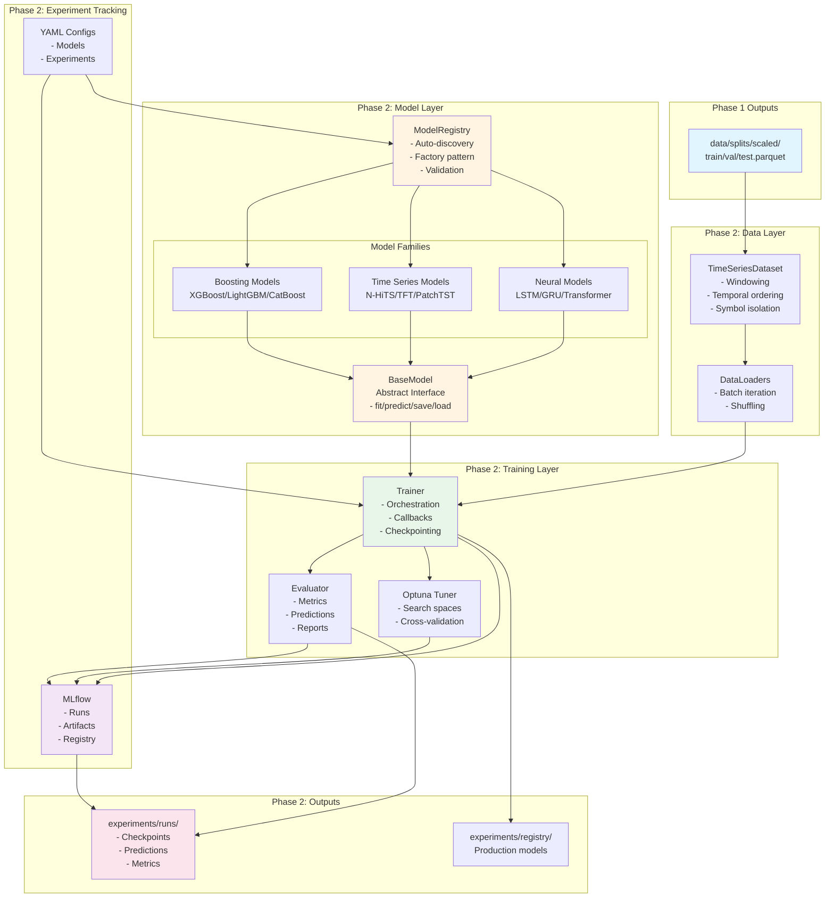
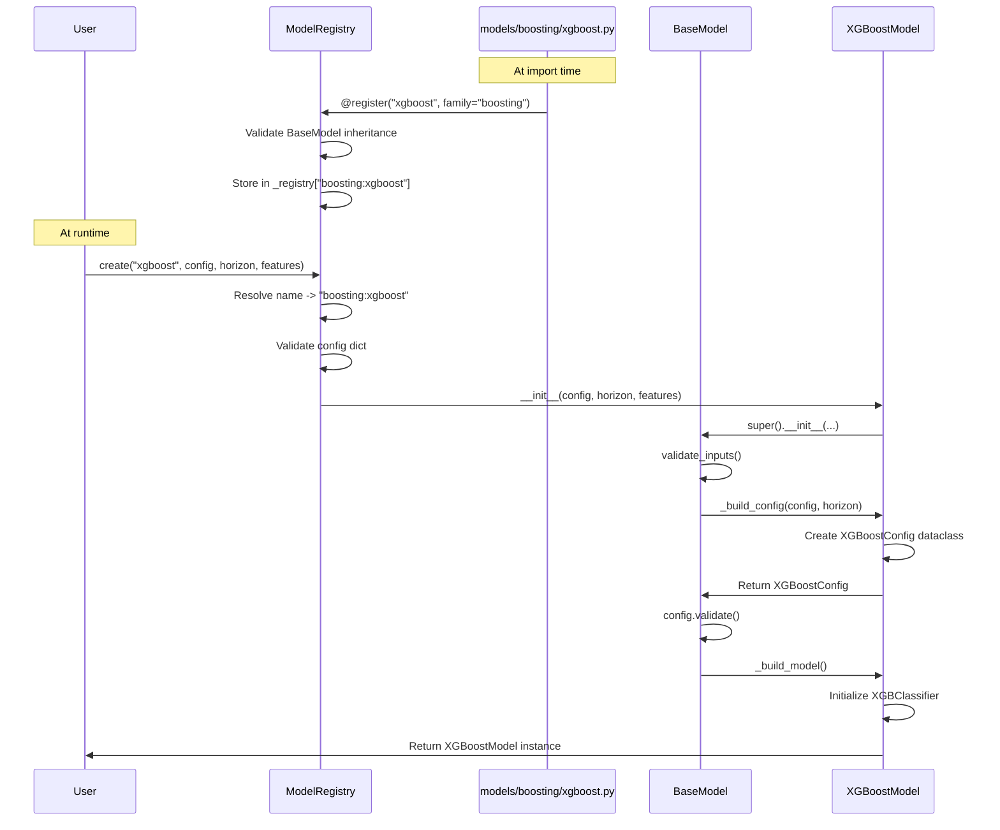
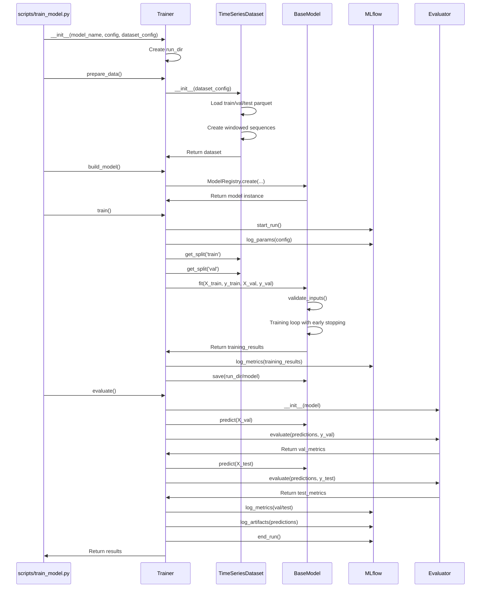
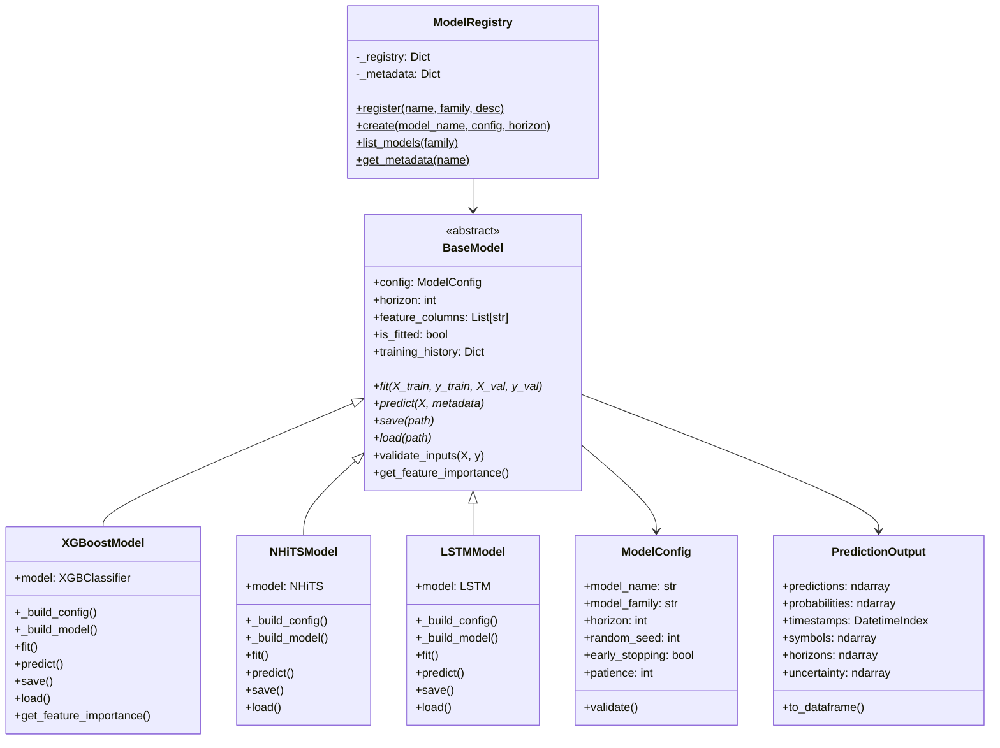
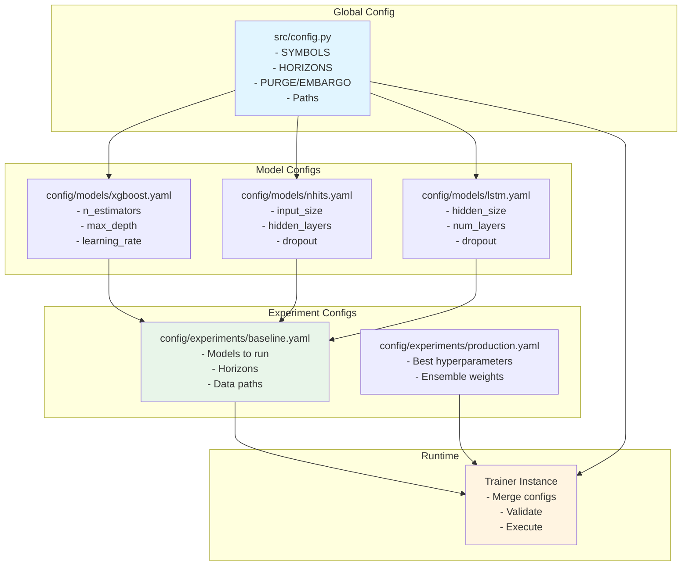
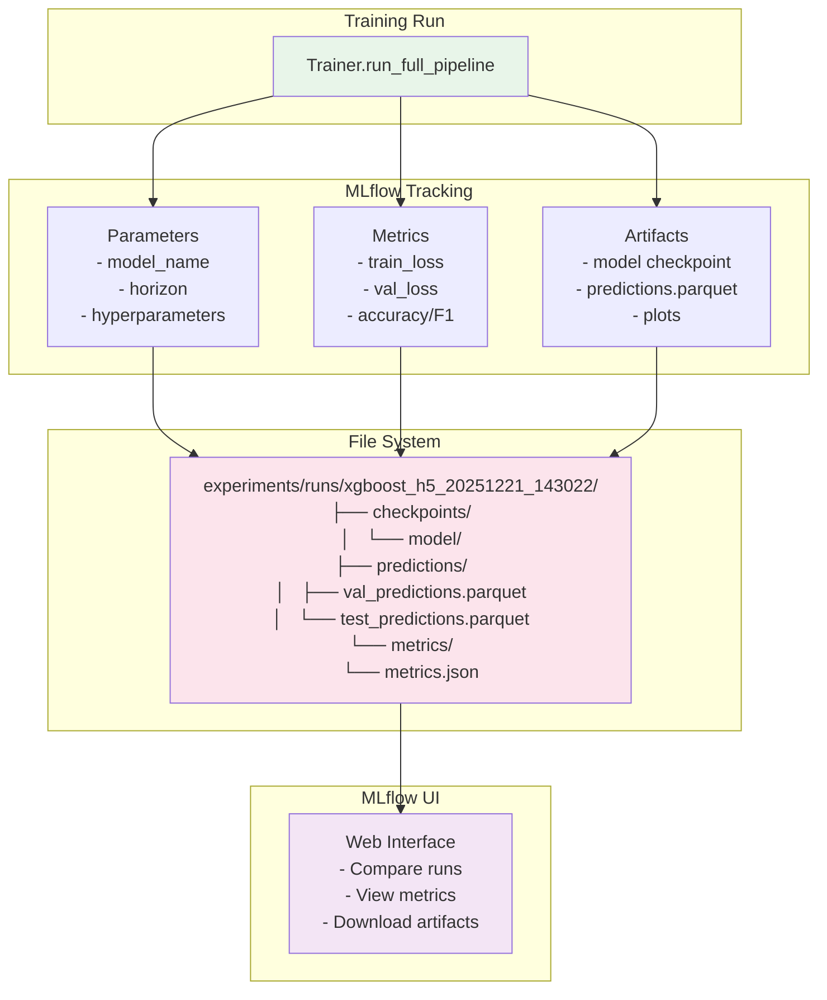
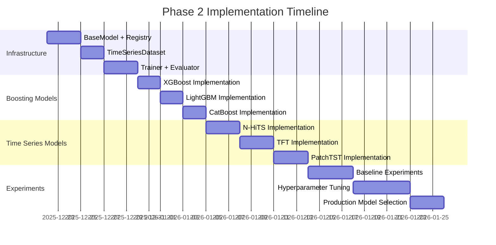

# Phase 2 Architecture Diagrams

## 1. System Architecture Overview



## 2. Model Registration & Instantiation Flow



## 3. Training Pipeline Flow



## 4. Data Flow: Phase 1 → Phase 2

```mermaid
graph LR
    subgraph "Phase 1 Output"
        P1A[train_scaled.parquet<br/>87,094 rows × 126 cols]
        P1B[val_scaled.parquet<br/>18,591 rows × 126 cols]
        P1C[test_scaled.parquet<br/>18,592 rows × 126 cols]
    end

    subgraph "TimeSeriesDataset Processing"
        LOAD[Load Parquet<br/>- Parse datetime<br/>- Filter symbols]
        WIN[Create Windows<br/>- seq_len=60<br/>- Symbol isolation<br/>- Temporal ordering]
        SEQ[Sequences<br/>X: (n, 60, 107)<br/>y: (n,)<br/>meta: DataFrame]
    end

    subgraph "Model Input"
        M1[Boosting Models<br/>Flatten to (n, 60×107)]
        M2[Time Series Models<br/>Use (n, 60, 107) directly]
    end

    P1A --> LOAD
    P1B --> LOAD
    P1C --> LOAD

    LOAD --> WIN
    WIN --> SEQ

    SEQ --> M1
    SEQ --> M2

    style P1A fill:#e1f5ff
    style P1B fill:#e1f5ff
    style P1C fill:#e1f5ff
    style SEQ fill:#e8f5e9
    style M1 fill:#fff4e1
    style M2 fill:#fff4e1
```

## 5. Model Family Architecture



## 6. Configuration Hierarchy



## 7. Experiment Tracking & Artifacts



## 8. Hyperparameter Tuning Flow

```mermaid
sequenceDiagram
    participant User
    participant Tuner as OptunaModelTuner
    participant Optuna
    participant Trainer
    participant Model

    User->>Tuner: __init__(model_name, search_space_fn, n_trials)
    User->>Tuner: tune()

    Tuner->>Optuna: create_study(direction='maximize')

    loop n_trials times
        Optuna->>Tuner: objective(trial)
        Tuner->>Tuner: search_space_fn(trial) -> config
        Tuner->>Trainer: __init__(model_name, config)
        Tuner->>Trainer: prepare_data()
        Tuner->>Trainer: build_model()
        Tuner->>Trainer: train()
        Trainer->>Model: fit()
        Trainer->>Tuner: Return training results
        Tuner->>Trainer: evaluate()
        Trainer->>Tuner: Return val_metrics
        Tuner->>Tuner: Extract metric_value (e.g., val_f1)
        Tuner->>Optuna: Return metric_value
        Optuna->>Optuna: Update best_params
    end

    Optuna->>Tuner: Return study
    Tuner->>User: Return best_params, best_value

    style Tuner fill:#f3e5f5
    style Optuna fill:#fff4e1
```

## 9. Phase 2 Milestone Timeline



---

## Key Design Principles Visualized

### Modularity (650-line limit)
```
├── base.py              (~250 lines)  ✓
├── registry.py          (~180 lines)  ✓
├── dataset.py           (~200 lines)  ✓
├── trainer.py           (~200 lines)  ✓
└── models/
    ├── xgboost.py       (~180 lines)  ✓
    ├── nhits.py         (~220 lines)  ✓
    └── lstm.py          (~190 lines)  ✓
```

### Fail-Fast Validation Points
```
1. Config validation  → ModelConfig.validate()
2. Input validation   → BaseModel.validate_inputs()
3. Registry check     → ModelRegistry.create()
4. Data loading       → DatasetConfig.validate()
5. Training           → Trainer.train()
```

### Zero-Leakage Guarantees
```
Phase 1: Purge (60) + Embargo (1440) at split boundaries
         ↓
TimeSeriesDataset: Symbol isolation + Temporal windows
         ↓
Phase 2 Models: Only past features in sequences
```

